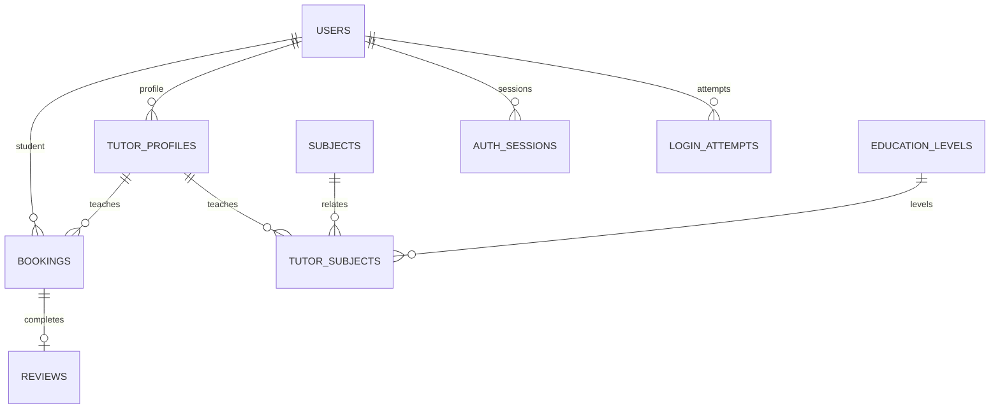

# Manual del sistema

## Arquitectura

ProfeGo es un monolito modular en PHP 8.3 con front controller en public/index.php. La lógica se divide por dominio en app/Modules y los servicios transversales en app/Shared.

## Módulos

- Auth: registro, autenticación, JWT, cierre de sesión.
- Bookings: reservas, disponibilidad, confirmación y cancelación.
- SearchReputation: catálogo de tutores, filtros y reputación.
- AIEngine: recomendaciones con adaptador mock o OpenAI.
- Integrations: proveedores de videoconferencia.

## Esquema ER

## Flujo de autenticación

1. El cliente envía email y contraseña a /api/auth/login.
2. AuthService valida credenciales y usa un error de respuesta con latencia uniforme.
3. Se crea un JWT HS256 con iss=profego, exp, jti y se guarda como cookie `profego_token` con HttpOnly+SameSite=Strict.
4. El middleware de autenticación valida la firma, el exp y el jti y rechaza los tokens revocados.

## Política de cookies y CSRF

- Las cookies de sesión usan `HttpOnly`, `SameSite=Strict` y `Secure` en producción o HTTPS.
- Los métodos no seguros requieren `Origin` o `Sec-Fetch-Site` válidos.
- El Router consume solo `$_GET` y `$_POST` más el JSON del request, nunca `$_REQUEST`.

## Despliegue

- `APP_ENV` debe ser `production` para habilitar la revisión de seguridad máxima.
- `JWT_SECRET` debe tener al menos 32 caracteres y no usar el placeholder.
- `DB_PATH` permite apuntar a una base temporal para pruebas sin dañar la base local.

## Backups

- Realizar copia de seguridad de la base SQLite antes de cualquier cambio de esquema.
- Evitar cambios destructivos en migraciones y validar siempre la reutilización de datos existentes.
